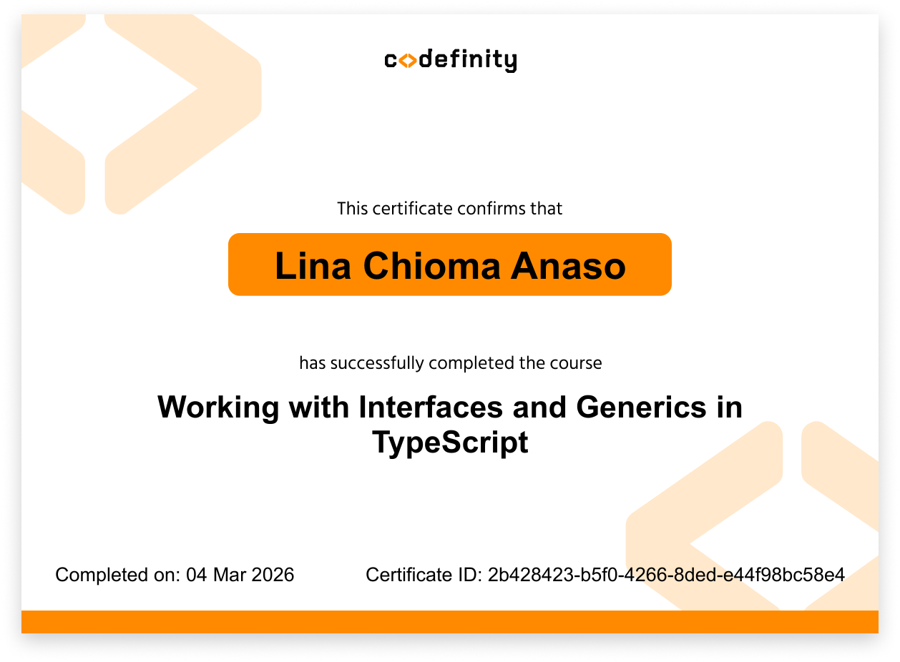

## 📚 TypeScript Concepts Covered

This repository contains hands-on exercises and challenges completed while deepening my TypeScript knowledge alongside my software engineering internship.

### Core Concepts

| Concept | Description |
|-------|-------|
| Interfaces | Defining structured object types |
| Generics | Creating reusable type-safe functions |
| Utility Types | Using built-in helpers like `Partial`, `Omit`, `Pick` |
| Union Types | Handling multiple possible types | 
| Literal Types | Restricting values to specific options |
# TypeScript Practice Repository

This repository documents my journey learning **TypeScript** while working as a **Software Engineering Intern**.

The exercises focus on building strong foundations in type safety, reusable code, and scalable data structures using modern TypeScript features.## 📜 Certification

Completed **Working with Interfaces and Generics in TypeScript** by Codefinity.

## 🧠 Skills Practiced

- TypeScript Interfaces
- Generics
- Utility Types (`Partial`, `Omit`, `Pick`)
- Union & Literal Types
- Type-safe function design
- Data modeling with TypeScript